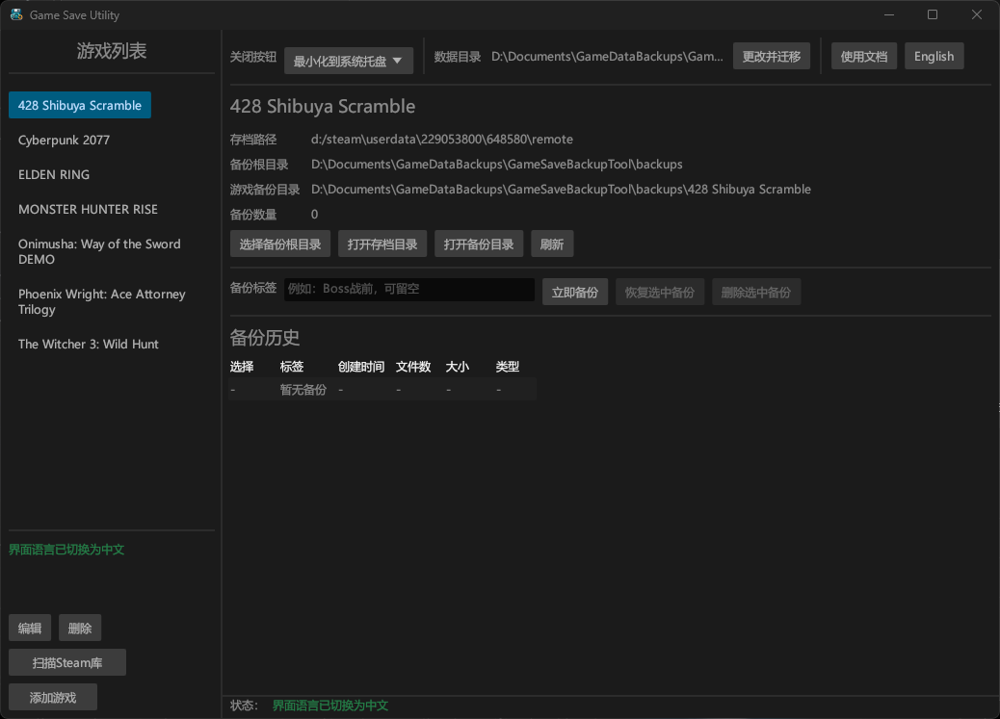
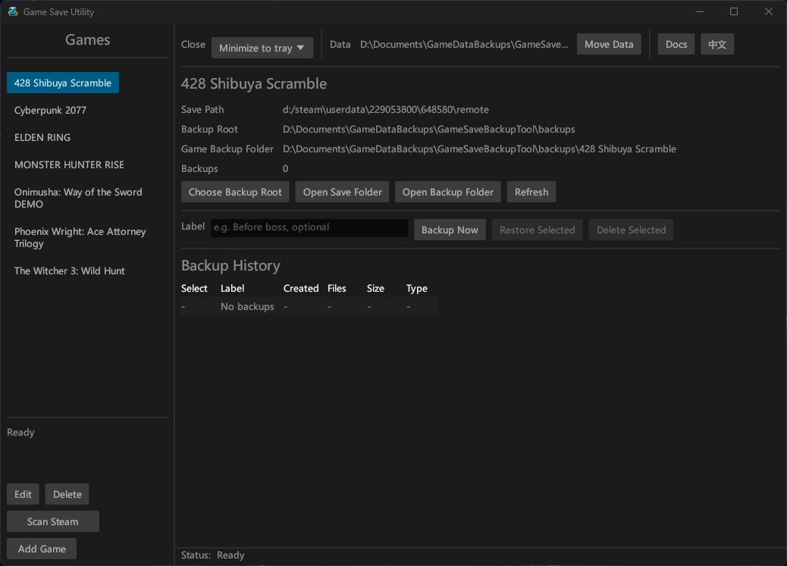

# Game Save Utility

<p align="center">
  
</p>

<p align="center">
  <strong>Language / 语言</strong><br>
  <a href="#zh-cn">简体中文</a> |
  <a href="#en">English</a>
</p>

---

<a id="zh-cn"></a>

## 简体中文

<p align="center">
  <a href="#zh-cn">简体中文</a> |
  <a href="#en">English</a>
</p>

**Game Save Utility** 是一个轻量的 Windows 桌面应用，用于手动管理任意单机游戏的本地存档备份与恢复。

项目使用 Rust + eframe/egui 开发，目标是生成尽量独立的单个 exe 文件。运行应用不需要安装 Node、Python、Java、Electron 或 .NET Runtime。

### 界面截图



### 主要功能

- 多游戏配置管理
- 手动添加、编辑、删除游戏
- 文件夹选择对话框
- 存档目录递归备份
- 备份标签和自动时间戳
- 每个备份节点写入 `metadata.json`
- 按游戏分目录管理备份
- 备份历史列表按时间倒序展示
- 恢复前自动创建“恢复前自动备份”
- 删除单个备份前确认
- 删除游戏配置时可选择是否同时删除备份文件
- 常见游戏路径预设
- 扫描 Steam 库，识别已安装游戏并提供候选存档目录
- Steam 扫描结果使用独立窗口，左侧游戏列表可拖动右边缘调整宽度
- 每个游戏可设置最大备份数量和自动清理
- 打开存档目录、打开备份目录
- 首次关闭时可选择“最小化到系统托盘”或“直接退出软件”
- 支持系统托盘图标，双击恢复窗口，右键菜单可显示窗口或正常退出
- 自动记住主窗口大小和最大化状态
- 支持更改 `GameSaveBackupTool` 数据目录，并迁移旧目录内容
- 支持中文 / English 双语界面，顶部按钮可切换并持久保存
- 顶部提供“使用文档 / Docs”按钮，打开可拖出主窗口的独立帮助窗口，支持目录和搜索
- 内置应用图标，并嵌入到 release exe
- 中文状态提示和简单日志记录

### 适用场景

- Boss 战前保存一个安全备份
- 剧情关键选择前保存进度
- DLC、二周目或不同流派开局前保存节点
- 防止误删、覆盖或云存档同步异常
- 管理多个单机游戏的本地存档

### 使用方法

1. 启动应用。
2. 点击“添加游戏”。
3. 输入游戏名称。
4. 选择或填写游戏存档目录。
5. 按需设置最大备份数量和自动清理。
6. 在主界面输入备份标签，点击“立即备份”。
7. 在备份历史中选择备份后，可以恢复或删除。

恢复存档前，应用会先自动备份当前存档目录，标签为“恢复前自动备份”。

也可以点击左侧“扫描Steam库”，从已安装的 Steam 游戏中批量添加有候选存档路径的游戏。扫描结果窗口中，左侧游戏列表的右边缘可以拖动，用于调整列表宽度。

主界面顶部的“English / 中文”按钮可切换界面语言；“使用文档 / Docs”会打开独立帮助窗口。帮助窗口随当前语言显示对应内容，并提供目录和搜索，可以拖到主窗口外侧，方便边看文档边操作工具。

### 运行时数据目录

应用会自动在当前 Windows 用户的应用数据目录下创建配置、日志和默认备份目录：

```text
%APPDATA%/GameSaveBackupTool/
  config.json
  logs/
    app.log
  backups/
```

配置文件为 JSON，便于查看、迁移和排查问题。主界面顶部提供“数据目录 -> 更改并迁移”。选择新位置后，应用会迁移配置、日志和默认备份目录，并写入位置文件：

```text
%APPDATA%/GameSaveBackupTool.location.json
```

### 备份目录结构

```text
backup_root/
  Cyberpunk 2077/
    2026-06-13_21-30-15_关键选择前/
      metadata.json
      save_files/
        ...
    2026-06-14_00-12-45_恢复前自动备份/
      metadata.json
      save_files/
        ...
```

每个备份节点包含 `metadata.json` 和完整复制的 `save_files/`。元数据记录游戏名称、原始存档路径、创建时间、用户标签、文件数量、总大小、工具版本以及是否为恢复前自动备份。

### 安全策略

备份时：

- 不修改原始存档目录
- 先复制到临时备份目录
- 元数据写入完成后再提交为正式备份目录
- 备份失败时清理未完成的临时目录
- 阻止把备份根目录设置到存档目录内部，避免递归备份

恢复时：

- 先检查备份节点和 `save_files/`
- 目标存档目录不存在时尝试创建
- 恢复前一定创建“恢复前自动备份”
- 使用临时目录分阶段恢复
- 恢复失败时保留恢复前自动备份，并显示错误提示

### 开发环境

开发和编译需要：

- Windows
- Rust stable 工具链
- Cargo

建议使用 MSVC 目标：

```text
x86_64-pc-windows-msvc
```

### 开发运行

```powershell
cargo run
```

### 测试

```powershell
cargo test
```

当前包含多项单元测试，覆盖备份、恢复、删除、Steam 库扫描、运行时图标加载和数据目录迁移等关键行为。

### 发布构建

开发时可以直接构建：

```powershell
cargo build --release
```

正式发布建议使用脚本，脚本会在私有构建目录中编译，并只把面向用户的正式文件放入 release 目录：

```powershell
.\scripts\build-release.ps1
```

生成文件示例：

```text
target/release/Game_Save_Utility_V0.1.0.exe
```

脚本会按 `Cargo.toml` 中的版本号生成文件名。发布构建已启用 LTO、单代码生成单元和 strip。

### 重要命名约定

- 项目正式名称和用户可见名称统一为 `Game Save Utility`。
- 正式发布文件名必须带版本号，例如 `Game_Save_Utility_V0.1.0.exe`。
- Cargo 内部包名为 `game-save-utility`。
- 不要再使用旧名称 `game-save-backup-tool` 作为项目名或发布文件名。

### 项目结构

```text
src/
  main.rs          应用入口
  app.rs           GUI 状态和主要交互
  models.rs        核心数据结构和错误类型
  config.rs        JSON 配置读写
  backup.rs        备份、恢复、扫描、删除、自动清理
  help.rs          内置帮助内容
  i18n.rs          双语界面文本
  presets.rs       内置游戏预设
  steam.rs         Steam 库扫描和候选存档目录识别
  tray.rs          Windows 系统托盘
  fs_utils.rs      文件系统工具、路径展开、目录统计、复制
  logger.rs        简单日志
  ui/
    backup_list.rs 右侧信息区和备份列表
    dialogs.rs     弹窗、Steam 扫描结果窗口和帮助窗口
    game_list.rs   左侧游戏列表
assets/
  app.ico
  app-icon-256.png
  readme-icon.png
scripts/
  build-release.ps1
```

### 注意事项

- 备份或恢复前请关闭对应游戏，避免存档文件被占用。
- 预设路径只是候选值，实际存档位置以本机环境为准。
- 删除游戏配置默认不会删除已有备份。
- 恢复操作会替换目标存档目录内容，请确认选择了正确的备份节点。
- 更改数据目录前，建议确认没有正在备份或恢复。
- 大型存档目录复制可能需要等待，当前版本暂未显示复制进度。

### 后续可改进项

- 复制进度条和后台任务
- 导入、导出配置
- 搜索游戏
- 恢复前自动备份保留策略优化
- 更完整的测试覆盖
- 安装包

---

<a id="en"></a>

## English

<p align="center">
  <a href="#zh-cn">简体中文</a> |
  <a href="#en">English</a>
</p>

**Game Save Utility** is a lightweight Windows desktop app for manually backing up and restoring local save files for single-player games.

The app is built with Rust + eframe/egui and is designed to ship as a mostly self-contained exe. Users do not need Node, Python, Java, Electron, or the .NET Runtime to run it.

### Screenshot



### Features

- Manage multiple game profiles
- Add, edit, and delete games manually
- Pick folders through a native folder dialog
- Recursively back up save folders
- Add backup labels and automatic timestamps
- Write `metadata.json` for every backup node
- Store backups by game folder
- Show backup history in reverse chronological order
- Automatically create a pre-restore backup before restoring
- Confirm before deleting an individual backup
- Optionally remove backup files when deleting a game profile
- Built-in common save path presets
- Scan Steam libraries, detect installed games, and suggest candidate save folders
- Open Steam scan results in a separate window with a resizable game list
- Configure max backup count and automatic cleanup per game
- Open the save folder or backup folder from the UI
- Choose whether closing the window minimizes to tray or exits the app
- Restore the window from the system tray and exit through the tray menu
- Remember the main window size and maximized state
- Move the `GameSaveBackupTool` data directory and migrate existing data
- Switch between Chinese and English in the app, with the choice saved to config
- Open a detachable Help / Docs window with contents and search
- Embed an application icon into the release exe
- Show localized status messages and write simple logs

### Use Cases

- Create a safe backup before a boss fight
- Save progress before major story choices
- Keep restore points for DLC, new playthroughs, or different builds
- Protect against accidental deletion, overwrite, or cloud sync issues
- Manage local save files for multiple single-player games

### How To Use

1. Start the app.
2. Click Add Game.
3. Enter the game name.
4. Choose or enter the game's save folder.
5. Set a max backup count and automatic cleanup if needed.
6. Enter a backup label on the main screen and click Back Up Now.
7. Select a backup from the history list to restore or delete it.

Before restoring a save, the app automatically backs up the current save folder with the label `Pre-restore automatic backup`.

You can also click Scan Steam Libraries to add installed Steam games that have candidate save folders. In the scan results window, drag the right edge of the game list to resize it.

The English / 中文 button in the top toolbar switches the UI language. The Help / Docs button opens a detachable help window that follows the current language and includes contents plus search.

### Runtime Data

The app creates config, logs, and the default backup folder under the current Windows user's app data directory:

```text
%APPDATA%/GameSaveBackupTool/
  config.json
  logs/
    app.log
  backups/
```

The config file is JSON, so it is easy to inspect, move, and troubleshoot. The toolbar includes a Data Directory -> Change and Migrate action. After a successful migration, the app writes a location file:

```text
%APPDATA%/GameSaveBackupTool.location.json
```

### Backup Layout

```text
backup_root/
  Cyberpunk 2077/
    2026-06-13_21-30-15_before-key-choice/
      metadata.json
      save_files/
        ...
    2026-06-14_00-12-45_pre-restore-automatic-backup/
      metadata.json
      save_files/
        ...
```

Every backup node contains `metadata.json` and a full copy of the save folder under `save_files/`. Metadata includes the game name, original save path, creation time, user label, file count, total size, tool version, and whether it is a pre-restore backup.

### Safety Model

When backing up, the app:

- Does not modify the original save folder
- Copies files into a temporary backup folder first
- Commits the backup only after metadata is written
- Cleans up unfinished temporary folders if backup fails
- Blocks placing the backup root inside the save folder to avoid recursive backups

When restoring, the app:

- Checks the backup node and `save_files/` first
- Tries to create the target save folder if it does not exist
- Always creates a pre-restore backup before replacing files
- Uses a temporary folder for staged restore work
- Keeps the pre-restore backup if restore fails and shows an error

### Development Requirements

- Windows
- Rust stable toolchain
- Cargo

The MSVC target is recommended:

```text
x86_64-pc-windows-msvc
```

### Run In Development

```powershell
cargo run
```

### Test

```powershell
cargo test
```

The current test suite covers backup, restore, deletion, Steam library scanning, runtime icon loading, and data directory migration behavior.

### Release Build

For development builds:

```powershell
cargo build --release
```

For user-facing release builds, use the script:

```powershell
.\scripts\build-release.ps1
```

Example output:

```text
target/release/Game_Save_Utility_V0.1.0.exe
```

The script reads the version from `Cargo.toml` and creates a versioned release filename. Release builds enable LTO, a single codegen unit, and strip.

### Naming Rules

- The official project and user-facing name is `Game Save Utility`.
- Release exe filenames must include the version, for example `Game_Save_Utility_V0.1.0.exe`.
- The internal Cargo package name is `game-save-utility`.
- Do not use the old name `game-save-backup-tool` for the project or release files.

### Project Layout

```text
src/
  main.rs          app entry point
  app.rs           GUI state and main interactions
  models.rs        core data structures and error types
  config.rs        JSON config loading and saving
  backup.rs        backup, restore, scan, delete, cleanup
  help.rs          built-in help content
  i18n.rs          bilingual UI text
  presets.rs       built-in game presets
  steam.rs         Steam library scanning and save path detection
  tray.rs          Windows system tray integration
  fs_utils.rs      filesystem helpers
  logger.rs        simple logging
  ui/
    backup_list.rs right-side details and backup list
    dialogs.rs     dialogs, Steam scan window, help window
    game_list.rs   left-side game list
assets/
  app.ico
  app-icon-256.png
  readme-icon.png
scripts/
  build-release.ps1
```

### Notes

- Close the target game before backing up or restoring, otherwise save files may be locked.
- Built-in save path presets are only candidates; the real location depends on the local machine.
- Deleting a game profile does not delete existing backups by default.
- Restore replaces the target save folder contents, so make sure the selected backup is correct.
- Before changing the data directory, make sure no backup or restore operation is running.
- Large save folders may take time to copy. The current version does not show copy progress yet.

### Roadmap

- Copy progress and background tasks
- Import and export config
- Game search
- Better retention policy for pre-restore backups
- More complete test coverage
- Installer package
